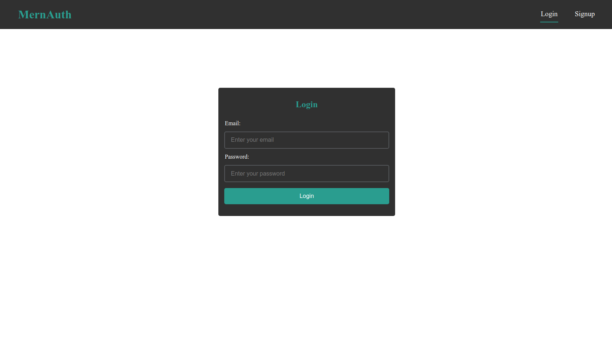

# Mern-Auth App (Frontend)

## Autenticación y autorización basada en JsonWebToken usando el Stack de Mern

Ejemplo de cómo consumir una api creada con nodejs y express consumiendo datos de una base de datos Mongodb

### Como realizar el Frontend de la aplicación usando React js'.'

En este repositorio realizo el frontend de la aplicación y realizo la conexión con 
el backend creado usando node js'.'

El manejo del estado global se realizo usando useContext y useReducer'.'